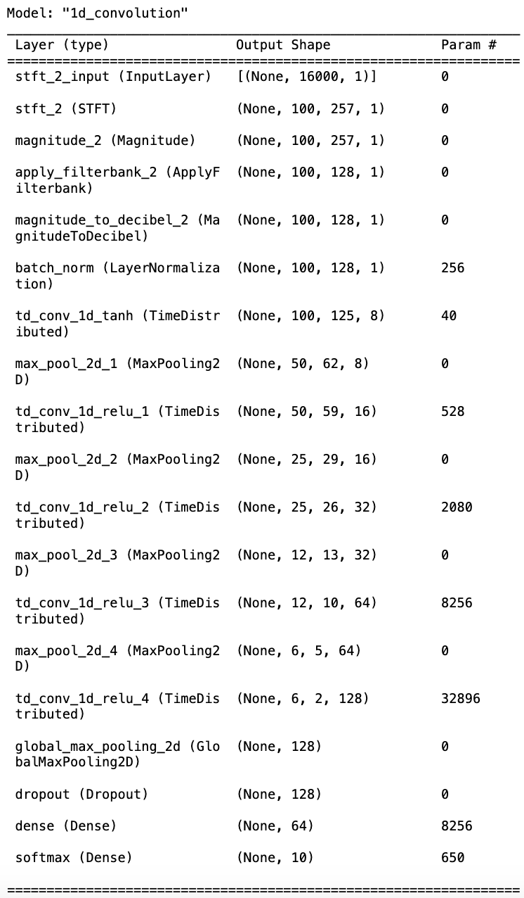
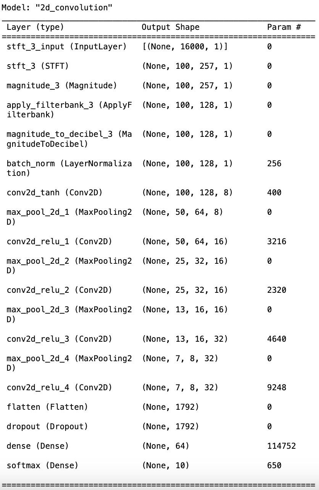
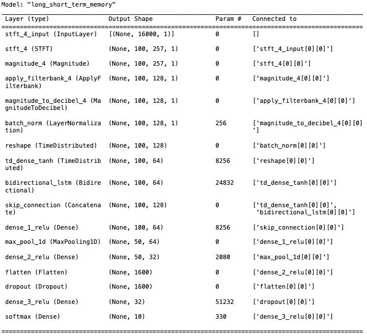

# Audio-Classification-CNN
This is a project using python models to classify audios.

In this project, CNN models including **Conv1D, Conv2D and LSTM** are used to classify audio files(musical instrument/type), and reaching a high accuracy ranging from **97% - 99%!**

## Data Downloading

Data Downloading Link:
https://zenodo.org/records/3685331 

Please download two files(TinySOL_metadata.csv, TinySOL.tar.gz). In this project, audio files are directly computed. However, using the file path included in TinySOL_metadata.csv to refer to the audio files is suggested as it is common practice.

## Data Preprocessing
*For simplicity and easy computing, the audio folder is suggested to be construcuted in only one layer:     instrument_folder -> class_folder -> audio.wav*
### clean.ipynb

**envelope(y, rate, threshold)**: This function detects the presence of audio above a certain threshold in an audio signal y sampled at rate.

**downsample_mono(path, sr)**: It reads an audio file from path, converts it to a single channel (mono) if it's stereo, and downsamples it to a new sampling rate sr.

**save_sample(sample, rate, target_dir, fn, ix)**: Saves a segment of an audio file sample at sampling rate rate to the target_dir with a modified filename based on fn and the index ix.

**check_dir(path**): Checks if a directory at path exists, and if not, creates it.

**test_threshold(args)**: testing the thresholding function. Manually test thresholds before calling split_wavs function.

**split_wavs(args)**: Main function that executesthe cleaning process.

## Model Training
### train.ipynb

**DataGenerator**: designed to handle audio files in .wav format and that the labels are integers or can be transformed into integers by the LabelEncoder.

**train_test_split**: the function from sklearn.model_selection is used to split the dataset into training and validation sets.

### Conv1D Layers

### Conv2D Layers

### LSTM Layers

## Model Prediction & Plot
### predict.ipynb & plot.ipynb

.png)

