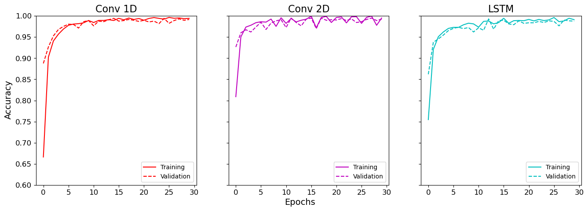

# Audio-Classification-CNN
This is a class project@Cornell Tech CS5785 23fall.

In this project, CNN models including Conv1D, Conv2D and LSTM are used to classify audio files(musical instrument/type), and reach a high accuracy ranging from 97% - 98%!

## Data Preprocessing
### clean.ipynb
*Audio folder should be construcuted in only one layer: instrument_folder -> class_folder -> aduio.wav*

## Model Training
### train.ipynb

## Model Prediction & Plot
### predict.ipynb & plot.ipynb